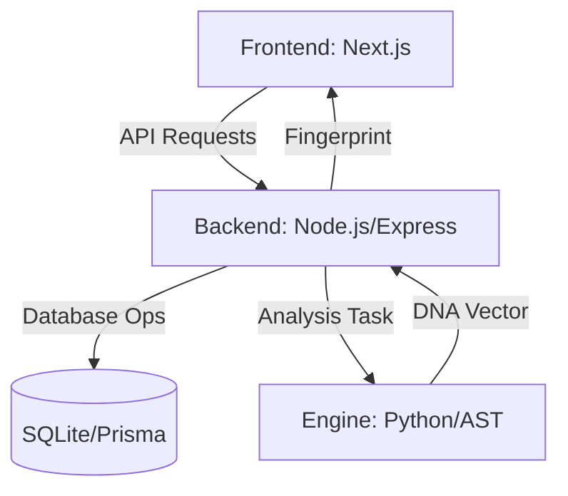
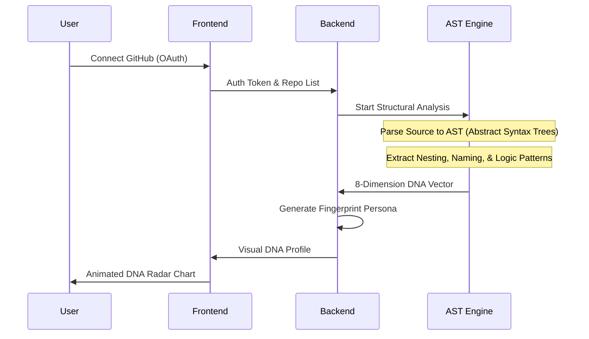

# Code DNA: Architecture & Security Architecture

This document outlines the industrial-grade workflow and security protocols implemented within the Code DNA platform.

---

## 1. System Architecture Overview

Code DNA operates on a tri-layer architecture designed for high-performance structural analysis and extreme data privacy.

---

## 2. Core Workflow: From Repo to DNA

The platform follows a non-invasive, purely structural analysis journey.

---

## 3. Security Protocols

Code DNA implements a "Defense in Depth" strategy across three distinct layers.

### A. Frontend Security (Industrial Guard)
- **Anti-Debugging Trap**: A self-invoking `debugger` loop that detects if DevTools is open in production and thwarts unauthorized logic inspection.
- **Console Security Guard**: Styled warnings to prevent Self-XSS attacks and social engineering scams.
- **Source Mangling**: Automatic minification and variable obfuscation (Next.js Build-time) to make production code unreadable without source maps.

### B. API & Infrastructure Security
- **DDoS Mitigation (Rate Limiting)**: Every IP is restricted to 100 requests per 15 minutes, preventing automated bots from overwhelming the server.
- **SQL Injection (SQLi) Immunity**: Powered by the **Prisma ORM**. All database queries are parameterized by default, ensuring that user input can never be executed as malicious SQL.
- **CORS Protection**: Strict origin filtering allows requests only from verified Code DNA domains.

### C. Data Integrity & Privacy
- **Read-Only GitHub Access**: The platform only requests `read` permissions. We never modify, push, or delete your code.
- **In-Memory Analysis**: Source code is parsed into Abstract Syntax Trees in-memory and **never stored** on our disks. Only the resulting metadata (numbers/vectors) is persisted.

---

## 4. Analysis Dimensions

The **AST Engine** maps your technical identity across 8 core structural dimensions:

1. **Structural Depth**: Measures nesting intensity and logical hierarchy.
2. **Modularity**: Analyzes function decoupling and reusability.
3. **Idiomatic Expression**: Detects adherence to language-specific best practices.
4. **Error Resilience**: Evaluates error handling patterns and safety checks.
5. **Namespace Hygiene**: Analyzes naming conventions and scope management.
6. **Concurrency Pattern**: Detects multi-threading and async/await logic.
7. **Complexity Gradient**: Maps the rise and fall of logic density across files.
8. **Dependency Gravity**: Evaluates the balance of internal vs. external logic.

---

> [!IMPORTANT]
> **Industrial Recommendation**: For production deployment, it is recommended to route all traffic through **Cloudflare** for edge-layer DDoS protection and WAF (Web Application Firewall) capabilities.
